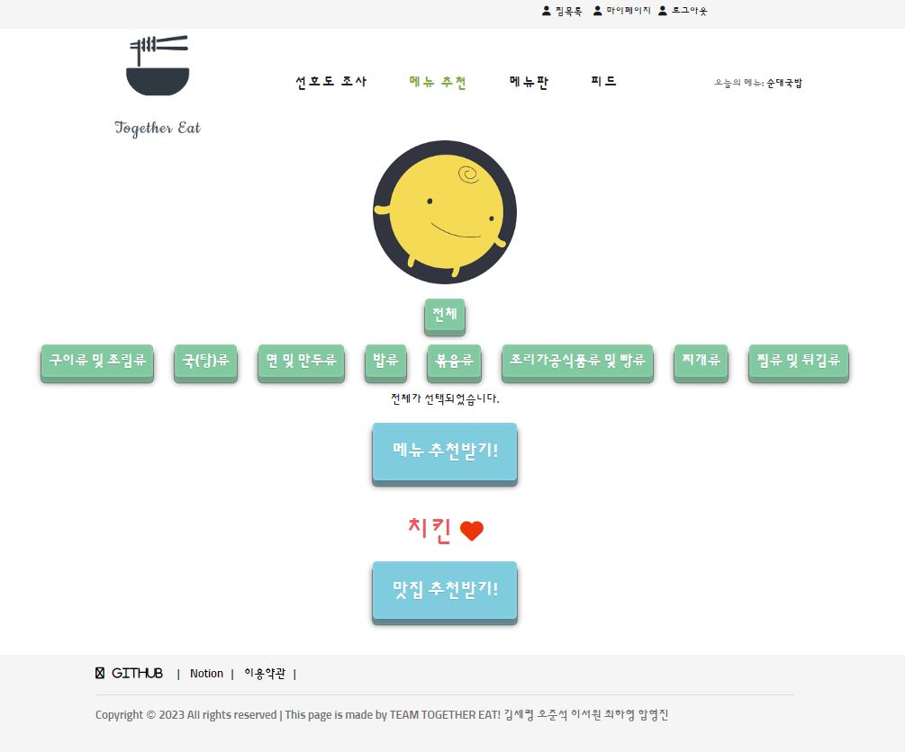

  <h1>Together Eat Web Service</h1>
  오늘도 점심 뭐 먹을지, 저녁 뭐 먹을지 결정 못하셨나요?  
  모든 사람들의 고민 '오늘 뭐 먹지?' 해결해드립니다!

## 🍜 How to use our web page

☘ 회원가입 후 좋아하는 음식, 싫어하는 음식, 못먹는 재료 등을 선택합니다. 
🍽 메뉴추천을 눌러 원하는 음식 종류의 탭을 누른 후 메뉴 추천받기 버튼 클릭! 
🍚 오늘 먹을 메뉴 고민 해결! 
🍔 보너스로 맛집 추천받기를 눌러 근처 음식점을 추천받을 수 있습니다! 
📲 시연영상 보러가기 => https://www.youtube.com/watch?v=U9AF70mipEM   

| 음식추천 페이지 | 맛집 추천받기 페이지 |
| -------- | -------- |
|   |   |

## 🎫 Service Architecture

## 📑 API Receipt

[api-receipt](https://juicy-point-b0c.notion.site/TogetherEat-API-Receipt-fe0d32d53d794b0784cb2b10a7fed813?pvs=4)

## 💡 Technical Decision
|Skill|Desciption|
|:---|:---:|
|NestJS|팀 단위의 프로젝트를 하기에 유리하고 빠른 아키텍처 빌드와 코드 유지 보수가 간편하여 선택|
|MySQL|유저의 음식 및 재료의 관계도를 설정하여 가중치에 의한 확률이 계산되도록 설계하기 위해 RDBMS인 MySQL을 선택|
|AWS RDS|MySQL을 지원하는 보다 관리가 쉽고 비용이 절감되어 선택|
|redis|회원가입 시 보내지는 인증 메일 및 코드를 저장하기 위함 / 최종 가중치를 빠르게 조회하기 위함 |
|redislabs|AWS에서 제공하는 elasticache도 있었으나 비용문제로 free-tire를 제공해주는 redislabs를 선택|
|KakaoMapAPI|네이버, 구글에 비해 무료로 사용할 수 있는 건수가 많으며 옵션들(marker 표시 등)이 많아 선택|
|nodemailer|회원가입 시 인증메일을 보낼 수 있도록 하는 장치(무분별한 가입과 유저의 개인화를 위해)|
|JWT|유저의 정보를 복호화하고 검증하기 위한 도구|
|Git-flow|팀원 각각이 맡은 기능을 합치고, 버전 관리와 에러 관리를 위해 github를 관리 |
|GithubActions|github에서 바로 사용 가능한 자동 배포 시스템|
|AXIOS|프론트와 백엔드 연결 시 JSON타입을 기본 지원하여 선택|
|AWS S3|피드에 올라갈 이미지 업로드와 자동 배포시 압축파일이 올라갈 수 있게 도와주는 bucket cloud|

## 💾 ERD Structure

## 👨‍👨‍👦 Contributors
- Project name : Together Eat!
- Duration: 2023.08.16 ~ 2023.09.18 5 weeks

|  |  |  |  |  |
| :---: | :---: | :---: | :---: | :---: |
| [김세령](https://github.com/KORjunseok) - 팀장 | [오준석](https://github.com/KORjunseok) - 부팀장 | [이서원](https://github.com/rymile)  | [최하영](https://github.com/rammakasty)  | [함형진](https://github.com/HyungJin0114)  |

